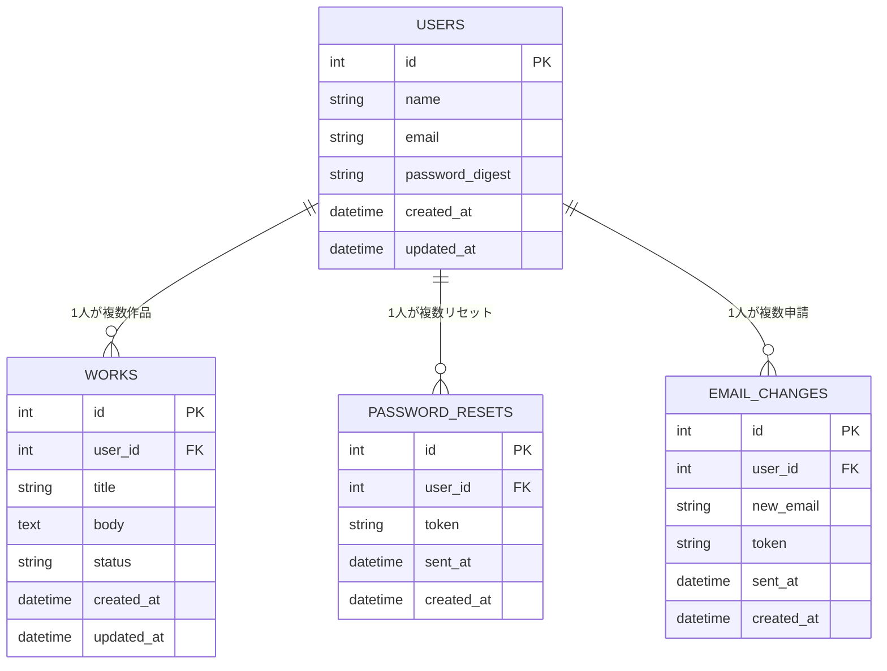

```mermaid
erDiagram
    USERS {
      int id PK
      string name
      string email
      string password_digest
      datetime created_at
      datetime updated_at
    }
    WORKS {
      int id PK
      int user_id FK
      string title
      text body
      string status
      datetime created_at
      datetime updated_at
    }
    PASSWORD_RESETS {
      int id PK
      int user_id FK
      string token
      datetime sent_at
      datetime created_at
    }
    EMAIL_CHANGES {
      int id PK
      int user_id FK
      string new_email
      string token
      datetime sent_at
      datetime created_at
    }

    USERS ||--o{ WORKS : "1人が複数作品"
    USERS ||--o{ PASSWORD_RESETS : "1人が複数リセット"
    USERS ||--o{ EMAIL_CHANGES : "1人が複数申請"
``` 