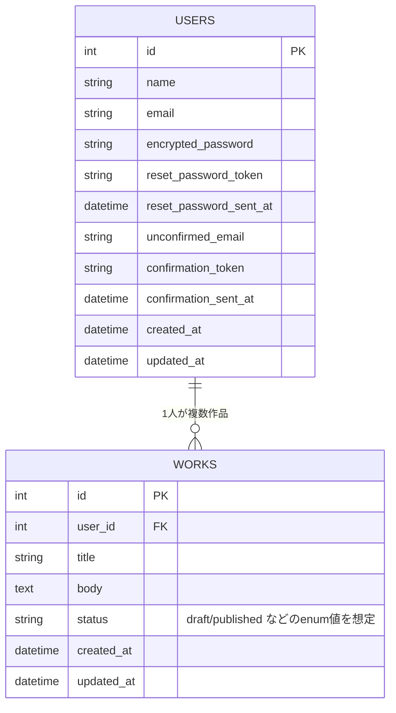

```mermaid
erDiagram
    USERS {
      int id PK
      string name
      string email
      string encrypted_password
      string reset_password_token
      datetime reset_password_sent_at
      string unconfirmed_email
      string confirmation_token
      datetime confirmation_sent_at
      datetime created_at
      datetime updated_at
    }
    WORKS {
      int id PK
      int user_id FK
      string title
      text body
      string status  "draft/published などのenum値を想定"
      datetime created_at
      datetime updated_at
    }

    USERS ||--o{ WORKS : "1人が複数作品"
``` 